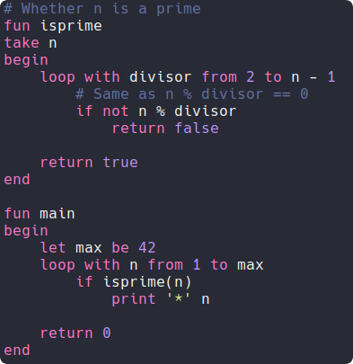
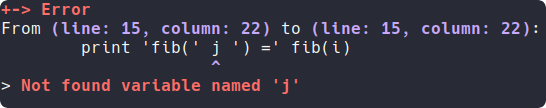

# The Alpha Compiler
Source for the Alpha language compiler and all its components.

## Summary

- [Examples](#Examples)
- [Features](#Features)
- [Installation & Usage](#installation)
- [Components](#Components)
- [Lexer-Parser](#Lexer-Parser)
- [Vim](#Vim)
- [Documentation](#Documentation)
- [References & Thanks](#references)

## Examples
See all examples [here](examples).

### Primes
[](examples/primes.alpha)
```
* 1
* 2
* 3
* 5
* 7
* 11
* 13
* 17
* 19
* 23
* 29
* 31
* 37
* 41
```

### Fibonacci
[](examples/fib.alpha)
```
fib( 1 ) = 1
fib( 2 ) = 2
fib( 3 ) = 3
fib( 4 ) = 5
fib( 5 ) = 8
fib( 6 ) = 13
fib( 7 ) = 21
fib( 8 ) = 34
fib( 9 ) = 55
fib( 10 ) = 89
```

### Alpha (Ascii Art banner)
Note that code in the preview is minimized (click on the image to view the full code).

[](examples/alpha.alpha)

Using sed to replace 0s and 1s this snippet outputs this :

```
| #..##..#....###..# |
| #.#..#.#....#..#.# |
| #.####.#....###..# |
| #.#..#.####.#....# |

| #.#..#..##..# |
| #.####.#..#.# |
| #.####.####.# |
| #.#..#.#..#.# |
```

## Features
Written in Julia, Alpha is a compiled, statically typed procedural language.
Furthermore, this language supports recursion and the compiler is multipass
(functions can be called before being declared).

In addition to the compiler, a lexer-parser generator which works like flex / bison is included.

Alpha is inspired by Julia and Python for the syntax, though it supports only integers for variables.

See a [brief syntax overview](docs/syntax.md).

## <span id="installation">Installation & Usage</span>
### Installation
To install Alpha, first install dependencies and follow these instructions :
```
julia
]
add https://github.com/Cc618/Alpha
```

After this, you can test whether the package is installed with this command :
```
julia -e "import Alpha; Alpha.alphamain()" help
```

Note that this step can take few seconds the first time the module is imported due to precompilation.

### Usage
To use Alpha, import it and run alphamain that interpretes program arguments.
```sh
julia -e "import Alpha; Alpha.alphamain()" <ARGS>
```

You might want to type only `alpha <ARGS>` instead of this long command.
To do so, you can install Alpha within /usr/bin with this script (requires root privileges) :
```sh
sudo ./install.sh
```

Otherwise, without root privileges you can create an alias and add it to your bashrc :
```sh
alias alpha='julia -e "import Alpha; Alpha.alphamain()"'
```

Here is the list of all commands :

| Command | Result |
| ------- | ------ |
| alpha `<file>.alpha`          | Compile `<file>.alpha` to `<file>`    |
| alpha run `<file>.alpha`      | Run `<file>.alpha`                    |
| alpha build `<file>.alpha`    | Build `<file>.o` object file          |
| alpha generate `<file>.alpha` | Generate `<file>.asm` assembly code   |
| alpha [help\|-h\|--help]      | Show help                             |

### Dependencies
Alpha targets Linux machines.
Moreover, it relies on some binaries :

- make
- gcc
- nasm
- julia

Alpha has been tested on Manjaro and Arch Linux (december 2020) with Julia 1.5.3.

### Notes for developers
To test Alpha, you can use the Makefile instead of recompiling the package for each test :
```
make
julia src/Alpha.jl <ARGS>
```

To build the package in local :
```
julia
]
add /abspath/to/Alpha
```

Note that dev can be used instead of add.

## Components
- alphalib : The Alpha standard library.
- docs : Project's documentation.
- examples : Some Alpha programs.
- parser : The lexer and parser generator.
- src : The Alpha Compiler.
- vim : Plugin for syntax highlighting.

## Lexer-Parser
A lexer and parser generator have been created.


The lexer supports custom regexes, the syntax is simple because Alpha's syntax is pretty easy.


The parser is an SLR(1) parser, it handles location detection to display meaningful errors.



### Links
- [Calculator example](examples/parser/calculator.syntax).
- [Parser documentation](docs/parser.md).
- [Lexer documentation](docs/lexer.md).

## Vim
The vim folder contains a plugin for Vim syntax highlighting, the script install.sh can be used to install it
or any Vim plugin manager can be used.

Vundle installation :
```vim
" In the plugin section of your .vimrc
Plugin 'Cc618/Alpha', {'rtp': 'vim/'}
```

Source your .vimrc or restart Vim and then type :
```vim
:PluginInstall
```

## Documentation
You can see all documentation pages [here](docs/README.md).


## <span id="references">References & Thanks</span>
This project was made with the help of this
[amazing book](https://www3.nd.edu/~dthain/compilerbook/).
Thanks Douglas Thain for posting freely these resources online.
